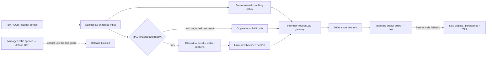

# ThinkBud

**Help the learner think. Then check what they can do without help.**

### [Try the live demo · 在线体验 →](https://jeffreyliu0131.github.io/thinkbud-ai/)

**About 3 minutes · Chinese / English · No account or installation needed**

[Start a maths exercise](https://jeffreyliu0131.github.io/thinkbud-ai/#/practice) · [90-second walkthrough](docs/DEMO_90_SECONDS.md) · [Product decisions](docs/CASE_STUDY.md)

ThinkBud is an AI learning and thinking coach prototype for primary-school **Chinese, maths, and English**. Its product goal is to help learners work through homework and explain their reasoning through guided dialogue. The online demo lets you try one concrete slice: **grade-4 maths practice**, from guided steps to a new problem without in-app hints.

The demo follows your browser's Chinese or English language preference, with a manual language switch. Answers, feedback, progress and optional local recovery really work; questions and coaching are preset. It runs on **GitHub Pages**, without live AI, account or backend services. This is an adult role-play demonstration; learning outcomes and child-facing release remain unvalidated. [Scope and coverage](#product-scope-and-current-coverage) · [Release boundary](#safety-and-release-boundary).

[](https://jeffreyliu0131.github.io/thinkbud-ai/)

### What to try

1. **Work through a guided problem.** Try an incorrect answer or ask for help to see how the next step changes.
2. **Solve a new problem independently.** Retries and requests for help remain visible in the observations.
3. **Preview the later check.** The immediate preview stays separate from the formal 24-hour check.

**Key product choice:** record guided completion, independent attempts, and help separately. Finishing a problem with support is not evidence of independent mastery.

### Explore the project

[Product decisions](docs/CASE_STUDY.md) · [Architecture](docs/ARCHITECTURE.md) · [Practice evidence](evals/practice/results/latest.md) · [Screenshots](docs/showcase/README.md) · [Run locally](#quick-start) · [Deployment guide](docs/OPERATIONS.md)

[](https://github.com/Jeffreyliu0131/thinkbud-ai/actions/workflows/ci.yml)

## Quick start

**For local development.** To try the published demo in your browser, use [the online experience](https://jeffreyliu0131.github.io/thinkbud-ai/) above.

```bash
npm ci
npm run demo
```

Open the printed local URL and select **开始数学体验**, or use the refreshable `/#/practice` deep link. The adult-only preview needs no account, provider credential, paid API, real learner record, or real textbook. The synthetic AI-boundary showcase is available at `/#/showcase` in demo mode.

For a fast code review, start here:

| Question | Source of truth |
|---|---|
| Does the deterministic coaching/safety gate pass? | [Behavior eval summary](evals/results/latest.md) and [machine-readable report](evals/results/latest.json) |
| Do retrieval filters, citations, budgets, bad cases, and guard integration pass? | [Textbook-RAG eval summary](evals/rag/results/latest.md) and [machine-readable report](evals/rag/results/latest.json) |
| What is actually implemented versus adapter-only or blocked? | [Architecture](docs/ARCHITECTURE.md) and [Textbook RAG + LLM backend](docs/TEXTBOOK_RAG.md) |
| Why is this not releasable to children yet? | [Release checklist](docs/RELEASE_CHECKLIST.md) and [privacy/child-safety boundary](docs/PRIVACY_AND_CHILD_SAFETY.md) |
| What are the asset and dependency rights gaps? | [Provenance audit](docs/PROVENANCE_AUDIT.md) and [generated inventory](artifacts/provenance/latest.json) |
| What product decisions and trade-offs shaped the system? | [Case study](docs/CASE_STUDY.md) and [coaching policy](docs/ThinkBud对话决策规范v5.md) |
| Can another public tool scan decision-to-code drift without private context? | [DecisionTrace local-only config](.decisiontrace/README.md) and [contract registry](.decisiontrace/contracts.yml) |

## Focused product question

This section describes the maths-only `/practice` demonstration, not the scope of the whole product. The multi-subject chat policy and this deterministic preview are separate paths.

The implemented slice is grade-4 distributive-property practice: four coached steps, two independent transfer steps, and two delayed-check steps on another item. It is a deterministic, adult-only product-workflow preview; its teaching prompts are preset rather than live-model output. The existing AI chat stack stays separate. These fixed integer items measure scaffolded near-transfer, not free-form or far-transfer ability. The 24-hour interval is a product default awaiting educational review. The [pilot protocol](docs/FIELD_PILOT_PROTOCOL.md) explains how a future adult role-play review can assess the teaching policy; no learning improvement is claimed.

## Product scope and current coverage

Scope checked against this public source and clarified by the owner on 2026-09-15. **ThinkBud is not restricted to maths.** This section owns the scope distinction used by portfolio and career materials; dated demo/evaluation records keep their original, narrower meaning.

| Layer | Current scope | What the evidence supports |
|---|---|---|
| Product purpose | Help primary-school learners understand homework and practise their own reasoning and expression through small-step dialogue | A product goal, not a measured learning outcome |
| Explicit subject policies | Chinese: pinyin, vocabulary, reading, sentence work and writing structure; maths: arithmetic, word problems, geometry and fractions; English: phonics/spelling, grammar, reading, cloze and translation scaffolding | Separate [subject modules](functions/_shared/prompt/subjects/) are assembled by the [server prompt builder](functions/_shared/prompt/index.ts) for grades 1–3 and 4–6 |
| Task-specific help | Chinese writing can receive a structure but not generated answer sentences; English definitions and grammar rules may be given directly while the learner applies them | The product cannot be accurately summarised as “never give any information” or “every subject ends in an arithmetic-style transfer test” |
| Maths demonstration | `/practice` contains a fixed grade-4 arithmetic learning loop for adult review | Demonstrates that particular workflow only; it does not define all ThinkBud subjects |
| Wider generalisation | The owner wants the shared thinking-coach approach to transfer beyond these three subjects | Potential to explore with a general-purpose model; no additional subject adapter, age group, curriculum coverage or reliable teaching outcome is established |

### Implementation gaps relevant to scope

- The chat and RTC APIs accept only `math`, `chinese`, and `english`. An omitted subject defaults to maths; an unsupported explicit subject is rejected. There is no implemented `general` subject mode.
- [ChatPage](src/pages/ChatPage.tsx) infers the prompt subject from OCR through [a character-count heuristic](src/lib/detectSubject.ts). Empty/short text can fall back to maths, and Chinese prose is not necessarily a Chinese-language homework question. This is not a validated subject classifier or a guarantee of correct routing for speech-only and mixed-subject sessions.
- The [session block](functions/_shared/prompt/session-manager.ts) asks the model to adjust between subjects, but the prompt builder injects only one subject toolbox at a time. This instruction does not prove that all subject-specific rules are reloaded at each topic change.
- The shared core and grade adapters still contain many maths examples. Their fit with writing and language tasks needs a separate review; the presence of three subject modules does not prove equally good teaching across them.
- Existing grade adapters cover grades 1–6. The early PRD's broader school-age/general-subject ambition and an adult testing audience do not establish a supported secondary-school or adult-learning product.
- The 2026-09-15 focused check passed 45 existing prompt tests across two files. These check prompt construction and encoded rules, with no live-model calls or real learner outcomes.

This correction changes documentation and the scope claim. It does not silently change routing, prompts, release gates, or the deployed product.

## Practice, transfer, and delayed observation

- **Help adapts to difficulty.** After two incorrect attempts at a coached step, the selected policy either gives a one-step prompt or explains the idea with a different worked example. The displayed help is recorded.
- **Transfer has its own boundary.** The learner expands a new expression, then calculates its result. Equivalent factor/term order is accepted. A correct final number alone does not complete the check. Retries remain visible; asking for help records an unfinished check and returns to coaching with fresh items.
- **Delay is enforced.** A formal review opens 24 hours after transfer completion according to the device clock. The review-flow preview uses a separate item and cannot change the real waiting period, records, or export.
- **Observations stay separate.** Guided completion, a first completion without in-app hints, retry completion, and help-seeking are distinct records. They do not update BKT, inferred mastery, account records, or parent reports.
- **Progress is optional and local.** Users may keep submitted numeric steps on the device for a seven-day validity period. Reload replays and validates the event history; malformed, future-dated, expired, and forged-state records are rejected. Pause/resume preserves current-page input. Storage failures leave the in-memory workflow usable.
- **Records can be inspected.** A local JSON export contains stage outcomes, unfinished-task counts, assistance counts, timestamps, and explicit prototype limitations. It excludes raw numeric attempts and all preview outcomes.

A short review: choose a help policy, deliberately make two mistakes in a coached step, inspect the different-example response, finish the guided and transfer items, then preview the delayed flow. The real delayed check must remain pending. Reload with local saving enabled to inspect recovery.

[Practice evaluation](evals/practice/results/latest.md) · [State machine](src/lib/practice.ts) · [Interaction tests](src/pages/__tests__/PracticePage.test.tsx)

## Product mechanism

1. A learner provides a question through text or the camera/OCR path.
2. Client history, OCR text, and learner context cross a shared untrusted-input boundary.
3. The server builds the grade- and subject-aware coaching policy; the browser cannot supply a system role.
4. Textbook RAG, when explicitly enabled and fully configured, retrieves filtered chunks and attaches structured citation metadata as untrusted context. Disabled, incomplete, failed, or empty retrieval falls back to non-RAG chat.
5. A provider-neutral LLM gateway records completion/stream, timing, usage, timeout, and error metadata while provider keys remain server-side.
6. The text turn is buffered and the blocking output guard runs **last**. Detected answer, indirect-answer, or worked-step leakage is replaced with a safe question before SSE display, persistence, or TTS.
7. Everyday chat retains user-triggered variation questions. The opt-in practice route separately controls coached steps, no-hint transfer, delayed review, and typed observations; its local records do not update chat-inferred learning state.



The default-off textbook path contains no real textbook, production embedding model, populated Vectorize index, durable chunk repository, or Vectorize deployment binding. Managed RTC also remains default-off because provider-managed speech bypasses the application output guard.

## Evidence chain

The public evidence is intentionally synthetic and reproducible:

```text
versioned synthetic fixtures + explicit expected outcomes
        ↓
deterministic behavior and RAG runners
        ↓
JSON / Markdown / HTML reports with source SHA + snapshot hash
        ↓
unit/integration tests + provenance inventory + production build
        ↓
CI (engineering gate)
        ↓
full release gate fails closed on missing human/legal/live-model evidence
```

The tracked behavior report covers 38 synthetic cases; the separate RAG report covers 14 retrieval and bad-case checks. Both record zero production-model calls and zero real child records. RAG evidence additionally records zero network calls and zero real textbook records. Exact counts and hashes live in the linked reports rather than in prose that can silently go stale.

Reports bind a Git base revision and an exact source-content hash, independently of later documentation commits. Captures from uncommitted changes disclose `sourceDirty=true`; historical screenshots keep their own frozen inputs.

`sourceDirty=false` means the evidence runner saw no uncommitted change in its declared source inputs. The source-content hash identifies the evaluated bytes; the Git base and dirty flag describe how they were captured. A reviewer can distinguish a committed revision from an uncommitted working snapshot without imposing an evidence-only HEAD commit.

Passing these deterministic gates proves only that the encoded mechanisms behaved as expected on the versioned synthetic set. It does not prove live-model teaching quality, adoption, learning impact, production latency/cost, privacy compliance, or textbook rights.

## Safety and release boundary

- Text output is guarded before display and TTS; model-judge scores cannot override deterministic hard failures.
- OCR, chat history, learner memory, and retrieved textbook excerpts are treated as untrusted data rather than privileged instructions.
- `RAG_TEXTBOOK_ENABLED`, server `RTC_ENABLED` and browser `VITE_ENABLE_RTC` are false by default. Supported deployment builds force browser RTC off; token/start APIs independently reject calls while the server flag is off.
- A default-off build neither prefetches the optional RTC SDK nor includes its 1.29 MB chunk in the PWA precache; explicit RTC builds can still load it on demand.
- RAG failure preserves the existing chat path and never changes the requirement that the output guard executes last.
- The full release gate is expected to fail until the owner chooses a project license, attests the 11 tracked assets, approves child/privacy controls, produces fresh live-model evidence, and completes two-rater blinded review.
- No real child/family/teacher data, real textbook content, production identifiers, or credentials belong in this repository or its public issues.

## What is implemented—and what is not

| Area | Implemented evidence | Honest limit |
|---|---|---|
| Coaching | Grade/subject prompt policy, one-action tutoring loop, transfer checks | Synthetic mechanism evidence only; no learning-outcome claim |
| Text safety | Blocking answer/step guard before text display/TTS | Pattern-based; novel leakage still requires fresh live evaluation and human review |
| RAG | Deterministic ingestion, readiness contract, filters, budgets, dedupe, citations, untrusted context, failure fallback | Default-off; synthetic corpus and fake embedding/store only |
| LLM | Provider-neutral gateway plus Ark adapter and offline fake provider | No public live-model evidence or bundled provider credentials |
| Voice | STT/TTS path and RTC failure recovery | Managed RTC bypasses the text guard and stays disabled |
| Practice workflow | Adaptive preset coaching, no-hint transfer, delayed gate, optional local resume, observation export | Adult-only, synthetic questions, device-clock timing; no live teaching or learning-impact claim |
| Learning signals | BKT, dialogue-derived knowledge signals, learner/parent views | Separate from practice observations; no validated learning impact |
| Privacy/security | Auth boundaries, rate limits, CSP, input sanitization, public safety docs | No approved DPIA, complete consent/notice, retention/deletion, vendor review, or admin hardening |

## Product ownership and AI collaboration

I owned the problem framing, coaching mechanism, product and safety constraints, prompt-policy evolution, acceptance criteria, trade-offs, evaluation design, evidence bar, and release decisions. AI coding agents acted as implementation and review collaborators: they proposed or changed code, generated synthetic fixtures, and helped diagnose failures. I constrained the scope, reviewed the changes, rejected unsupported claims, and required reproducible tests and fail-closed release gates.

That division matters: repository activity or agent-generated prose is not treated as user evidence. Product claims are limited to what the code, versioned fixtures, generated reports, and explicitly identified human evidence can support.

## Run and review locally

Supported baseline: Node.js 22 and the committed npm lockfile.

```bash
# Full deterministic engineering gate
npm ci
npm run verify

# Public-boundary and committed evidence-pair checks
npm run public:check
npm run evidence:verify

# Registry-backed dependency check
npm audit --audit-level=high

# Credential-free synthetic showcase build
npm run demo:build

# Expected to exit non-zero until human/legal/live evidence is complete
npm run release:check
```

For the credential-free demonstration, use `npm run demo`; for the original frontend, use `npm run dev`. Original server credentials belong in ignored `.dev.vars`; never prefix credentials with `VITE_`. No server setup is needed for the static publication.

Provider-backed routes require the reviewer's own server-side accounts and keys. Provider credentials are never required by the browser bundle and must remain in ignored environment files.

Offline Markdown/plain-text ingestion is available through `npm run rag:ingest -- ...`. It writes a manifest only; there is no public anonymous upload endpoint. A source without complete owner, provenance, license, and production authorization is explicitly non-production-ready.

## One maintained code source

Development continues on this repository’s `main`. The public deployment target is now a credential-free static adult demo on GitHub Pages. The existing service code stays in this source tree, and the private repository retains its history. Real-service migration is cancelled for this task; its data, runtime and publishers remain untouched. The [operations runbook](docs/OPERATIONS.md) owns the static build, manual deployment, version checks and rollback. Formal product/service release retains the full gate.

## Repository map

- `functions/api/` — Cloudflare Pages API handlers and the guarded chat boundary.
- `functions/_shared/` — prompt policy, input/output safety, provider gateway, RAG contracts, retrieval, and adapters.
- `src/` — React product UI, voice pipeline, learning evidence, and synthetic showcase.
- `evals/` — human-authored synthetic cases, deterministic runners, bad cases, and generated evidence.
- `artifacts/` — reviewable HTML/provenance outputs generated by repository scripts.
- `docs/` — architecture, evaluation, privacy, provenance, pilot, case-study, and release decisions.
- `.decisiontrace/` — local-only public scan contract; gates disabled and generated reports ignored.
- `.github/workflows/` — read-only CI, full service-release checks, and manually dispatched static GitHub Pages publication.

## Current release blockers

The engineering gate can pass while the product release remains blocked. The unresolved items require owner, legal/privacy, live-provider, or independent-human evidence and must not be auto-filled:

1. explicit project-license choice and first-party rights confirmation;
2. owner attestation for 11 tracked icons/illustrations/worklet/fixture assets;
3. DPIA, age/guardian consent, child-readable notice, retention/export/correction/deletion, vendor processing, admin access, and incident procedures;
4. fresh live-model outputs tied to an exact model/prompt/config/transport;
5. two-rater blinded review of those outputs;
6. RTC architecture or evidence that can enforce an equivalent pre-speech safety boundary;
7. source-specific rights, deletion/versioning, production embeddings, durable storage, and rollback before any real textbook RAG.

## License

No open-source license is granted. The source is public for portfolio review and technical discussion; all rights are reserved. Choosing a license is an explicit owner decision and remains outside automated release work.

## Audit acceptance · 2026-09-05

Locally verified: 408 tests passed with 2 existing skips; lint, typecheck, production build, 38 behavior cases, 14 RAG cases and current source-content consistency passed. Cross-account SQL writes and pre-provider rejection have regression coverage. Parent-facing knowledge labels now describe dialogue observations rather than independently proven mastery. That repair was subsequently published as `d8330f1`; CI status should be read from the commit-specific GitHub run. No production deployment was included. The separate full release remains blocked on its existing human/live/privacy/license requirements.


## Practice workflow acceptance · 2026-09-07

The user selected the focused learning loop and authorized this public implementation. Codex implemented the state machine, interface, synthetic scenarios, tests, and documentation. This slice demonstrates an inspectable product mechanism; it is not independent user capability evidence or a study result.

Local engineering verification: 426 tests passed with 2 existing skips; the 38-case behavior gate, 14-case RAG gate, and 15-case practice gate passed. Lint, TypeScript, production and synthetic-demo builds passed. Desktop and 390px browser QA passed: adaptive help, guided/transfer completion, isolated review preview, local reload recovery, and a downloaded observation export were exercised. The mobile layout had no horizontal overflow. Evidence reports identify the source-content snapshot and disclose capture from the working tree. Historical screenshot provenance remains unchanged.

Dependency audit passed the CI high-severity threshold; two pre-existing moderate development-dependency advisories remain (`@humanfs/node` and `qs`). No dependency version was changed in this slice.

The child-facing deployment, live-model teaching quality, independent teacher review, textbook rights, and learning-effect gates remain separate and unresolved. They do not prevent publishing this explicitly bounded public prototype.

## Static demo acceptance and publication status · 2026-09-21

**Published static demo: [open ThinkBud](https://jeffreyliu0131.github.io/thinkbud-ai/). Accepted for adult portfolio/interview demonstration.** The browser runs a real, bounded maths workflow; the teaching content is preset. This acceptance does not establish real AI tutoring, three-subject interactive coverage, learning outcomes, or child-release readiness.

| Layer | What actually works in this candidate | Inspectable basis |
|---|---|---|
| Running frontend | Numeric input and validation; two help policies; separate guided/independent stages; retries and help-seeking; pause/reset; optional seven-day local recovery; JSON export | [Practice page](src/pages/PracticePage.tsx), [state machine](src/lib/practice.ts), [storage replay](src/lib/practiceStorage.ts) |
| Preset simulation | Fixed maths items and coaching text; sample dialogue; four selectable RAG states and a recorded output-guard result | [Showcase](src/pages/SyntheticDemoPage.tsx), [synthetic reports](public/) |
| Delayed observation | A device-clock 24-hour gate; an immediately usable separate preview that cannot complete or alter the formal check | [Practice mechanism](src/lib/practice.ts), [captured observation export](docs/showcase/2026-09-21/observations-first-attempt.json) |
| Services outside this demo | Live models, accounts/SMS, camera/OCR, STT/TTS/RTC, business DB and real textbook retrieval are not loaded by the static entry | [Demo entry](src/DemoApp.tsx), [package boundary check](scripts/check-static-demo.mjs) |

The accepted copy was reconstructed on public base `620b2fddcfded13cf8be2715e4c2b1f8cccc611e`. Before repair, its 299 non-ignored source files matched the prior candidate byte-for-byte, including untracked additions and removals. The prior candidate's local `acfdba3` commit was not imported into this checkout; only reviewed source bytes were carried over. At local acceptance this candidate was uncommitted. Its pre-publication demo-input SHA-256 was `2f655490649b3c5c25ad8cb722bfc8a586a9df40eee3590680eba8afb92e9352`. The deployed version is identified by the live `build-info.json`.

The independent browser review found and repaired three presentation/reliability issues: the engineering-heavy mixed-language entry hid the product story; a malformed report caused a blank page and missing reports gave developer-only instructions; stage completion lost keyboard focus. The entry now leads to the learning loop, technical evidence is optional, report loads are validated/bounded/retryable without blocking practice, and completion focus lands on the next-stage card. Mobile zoom is enabled and RAG choices fit a two-column narrow layout.

Actual verification used the built package under `/thinkbud-ai/`: desktop 1280×800, narrow 390×844 and 320×844; typed incorrect/correct answers; both help policies; equivalent factor order; first-attempt versus retry outcomes; independent help-seeking; pause/reset; optional persistence and hash refresh; a completed preview that leaves formal review pending; and an actual downloaded JSON export excluding raw answers and preview outcomes. Keyboard entry/Tab order and visible focus were checked. Three report endpoints and `build-info.json` returned actual **200 application/json**, without HTML fallback. Fault injection covered malformed `{}` reports, HTTP 503, slow loading and recovery through the retry button.

Initial acceptance validation passed: 14 core workflow tests and 9 page interaction tests, TypeScript, ESLint on changed code, the static build/package boundary, public-boundary scan, and source/report consistency. Behavior/RAG/practice synthetic gates passed 38/14/15 cases. This is focused verification of the accepted change; earlier full-suite totals are historical, not a substitute for this browser review.

The served static entry has only two automatic report fetches, both under the same base. Its import graph contains no service entry; the package CSP restricts connections to the same origin. The observed local HTTP log contained static assets/reports only, and the normal browser run had no console/CSP errors. No live service/API was used. This check combines source/package inspection and HTTP/console evidence, not a claim of a separate network-panel trace.

Limits: no physical-phone or screen-reader session was run; no real 24-hour longitudinal observation or teaching-effect study occurred. Controlled-clock tests cover the due-date mechanism. The original services, credentials, data, publishers and private repository remain outside this work. No commit, push, Pages configuration or deployment was performed during that local acceptance stage. [Operations](docs/OPERATIONS.md) owns the eventual explicitly authorized publication and reproduction steps; [the walkthrough](docs/DEMO_90_SECONDS.md) is the interview entry.

## Bilingual interface refinement · 2026-09-21

The demo now follows the browser/system language preferences: the first supported Chinese (`zh-*`) or English (`en-*`) preference wins; other languages fall back to English. Chinese is displayed in Simplified Chinese. The page header offers **System / 中文 / English**; a manual choice is stored only on the device and applies across refreshes and demo routes. Returning to System follows the browser again. If preference storage is blocked or full, switching still works for the current page. This UI localisation does not add an English-subject tutoring workflow.

The whole practice path is translated, including preset examples, validation, help, outcomes, recovery notices and dates. Switching language preserves in-progress inputs and observation counts. Export keys, event history and original evidence-report data remain unchanged. The HTML language and document title follow the selected UI language.

UI refinement uses the existing visual style: a shared language control, a shorter first-screen layout, matching dark colours on the practice page, clear success/error feedback, quieter motion, touch-friendly controls and return-to-top route navigation. A 320px check caught and fixed an overlap between the language control and the home brand; the source link remains in the footer on small screens.

Verification: 11 locale/preference tests and 10 existing/extended page interaction tests passed, alongside TypeScript, changed-code ESLint, static build/package checks and source/report consistency. The browser's current system setting selected Chinese; switching to English survived reload and navigation. English guided practice, repeated mistakes, mid-answer language switching, independent transfer and the isolated review preview were exercised on desktop and at 390px/320px. Observation counts, pending formal review and local recovery stayed intact. English retrieval states and their labels also worked. Browser validation used the current dark theme; a physical mobile device and screen reader were not used.

This refinement was first accepted locally against public base `620b2fd`, before the online demo was published. That historical checkpoint is superseded by the GitHub Pages publication recorded below. `127.0.0.1` remains a local preview address; visitors should use [the published demo](https://jeffreyliu0131.github.io/thinkbud-ai/).

## Static publication verification · 2026-09-21

The bilingual interactive demo was published from `901586b2f3861e17312ca49435b6a86b16d04ee3` through the [successful Pages workflow](https://github.com/Jeffreyliu0131/thinkbud-ai/actions/runs/35616626386). Public CI also passed. The live [build information](https://jeffreyliu0131.github.io/thinkbud-ai/build-info.json) matches that exact commit with `sourceDirty=false`, static mode, and no backend or model calls. All three report URLs returned HTTP 200 JSON.

Release verification passed 450 tests with 2 existing skips, lint, TypeScript, build, public/package boundaries and the 38/14/15 synthetic behavior/RAG/practice gates. Online browser checks covered the Chinese system default, English navigation into practice, incorrect-answer feedback, and switching to Chinese while preserving the entered answer and attempt counts. Earlier detailed local interaction and narrow-screen acceptance remains documented above. Real models, physical-device acceptance, learning outcomes and the original Cloudflare/Vercel service remain outside this static release.
