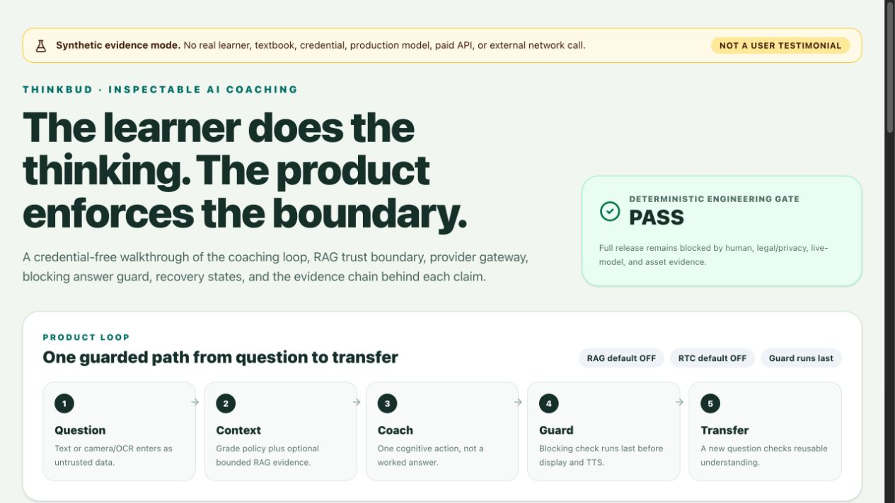
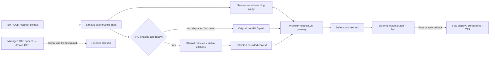

# ThinkBud

[](https://github.com/Jeffreyliu0131/thinkbud-ai/actions/workflows/ci.yml)

ThinkBud is an AI thinking coach for primary-school learners. The problem it tackles is not access to answers; it is the ease with which an AI tutor can replace the learner's reasoning. ThinkBud therefore turns a homework question into a short coaching loop that asks for one cognitive action at a time, checks transfer, and blocks detected answer leakage before text reaches the learner.

> **Product rule:** AI guides the thinking process; the learner owns the answer.

This repository is a working, reviewable prototype and product-evidence trail. It is not evidence of product-market fit, measured learning outcomes, a production-safe child deployment, or a live textbook corpus.

## See the product and evidence in 60 seconds

```bash
npm ci
npm run demo
```

Open the printed local URL. Synthetic demo mode needs no account, provider credential, paid API, real learner record, or real textbook. It shows the coaching loop beside the deterministic release evidence that produced it.



[Inspect the showcase states and capture provenance](docs/showcase/README.md).

For a fast code review, start here:

| Question | Source of truth |
|---|---|
| Does the deterministic coaching/safety gate pass? | [Behavior eval summary](evals/results/latest.md) and [machine-readable report](evals/results/latest.json) |
| Do retrieval filters, citations, budgets, bad cases, and guard integration pass? | [Textbook-RAG eval summary](evals/rag/results/latest.md) and [machine-readable report](evals/rag/results/latest.json) |
| What is actually implemented versus adapter-only or blocked? | [Architecture](docs/ARCHITECTURE.md) and [Textbook RAG + LLM backend](docs/TEXTBOOK_RAG.md) |
| Why is this not releasable to children yet? | [Release checklist](docs/RELEASE_CHECKLIST.md) and [privacy/child-safety boundary](docs/PRIVACY_AND_CHILD_SAFETY.md) |
| What are the asset and dependency rights gaps? | [Provenance audit](docs/PROVENANCE_AUDIT.md) and [generated inventory](artifacts/provenance/latest.json) |
| What product decisions and trade-offs shaped the system? | [Case study](docs/CASE_STUDY.md) and [coaching policy](docs/ThinkBud对话决策规范v5.md) |
| Can another public tool scan decision-to-code drift without private context? | [DecisionTrace local-only config](.decisiontrace/README.md) and [contract registry](.decisiontrace/contracts.yml) |

## Product mechanism

1. A learner provides a question through text or the camera/OCR path.
2. Client history, OCR text, and learner context cross a shared untrusted-input boundary.
3. The server builds the grade- and subject-aware coaching policy; the browser cannot supply a system role.
4. Textbook RAG, when explicitly enabled and fully configured, retrieves filtered chunks and attaches structured citation metadata as untrusted context. Disabled, incomplete, failed, or empty retrieval falls back to non-RAG chat.
5. A provider-neutral LLM gateway records completion/stream, timing, usage, timeout, and error metadata while provider keys remain server-side.
6. The text turn is buffered and the blocking output guard runs **last**. Detected answer, indirect-answer, or worked-step leakage is replaced with a safe question before SSE display, persistence, or TTS.
7. The learner explains a step; a transfer question checks whether the idea can be reused before the session updates learning evidence.



The default-off textbook path contains no real textbook, production embedding model, populated Vectorize index, durable chunk repository, or Vectorize deployment binding. Managed RTC also remains default-off because provider-managed speech bypasses the application output guard.

## Evidence chain

The public evidence is intentionally synthetic and reproducible:

```text
human-authored fixtures + expected outcomes
        ↓
deterministic behavior and RAG runners
        ↓
JSON / Markdown / HTML reports with source SHA + snapshot hash
        ↓
unit/integration tests + provenance inventory + production build
        ↓
CI (engineering gate)
        ↓
full release gate fails closed on missing human/legal/live-model evidence
```

The tracked behavior report covers 38 synthetic cases; the separate RAG report covers 14 retrieval and bad-case checks. Both record zero production-model calls and zero real child records. RAG evidence additionally records zero network calls and zero real textbook records. Exact counts and hashes live in the linked reports rather than in prose that can silently go stale.

`sourceDirty=false` means the evidence runner saw no uncommitted change in its declared source inputs. Evidence commits point back to the clean code commit they evaluated, so a reviewer can inspect both the implementation SHA and the generated result.

Passing these deterministic gates proves only that the encoded mechanisms behaved as expected on the versioned synthetic set. It does not prove live-model teaching quality, adoption, learning impact, production latency/cost, privacy compliance, or textbook rights.

## Safety and release boundary

- Text output is guarded before display and TTS; model-judge scores cannot override deterministic hard failures.
- OCR, chat history, learner memory, and retrieved textbook excerpts are treated as untrusted data rather than privileged instructions.
- `RAG_TEXTBOOK_ENABLED` and `VITE_ENABLE_RTC` are false by default.
- A default-off build neither prefetches the optional RTC SDK nor includes its 1.29 MB chunk in the PWA precache; explicit RTC builds can still load it on demand.
- RAG failure preserves the existing chat path and never changes the requirement that the output guard executes last.
- The full release gate is expected to fail until the owner chooses a project license, attests the 11 tracked assets, approves child/privacy controls, produces fresh live-model evidence, and completes two-rater blinded review.
- No real child/family/teacher data, real textbook content, production identifiers, or credentials belong in this repository or its public issues.

## What is implemented—and what is not

| Area | Implemented evidence | Honest limit |
|---|---|---|
| Coaching | Grade/subject prompt policy, one-action tutoring loop, transfer checks | Synthetic mechanism evidence only; no learning-outcome claim |
| Text safety | Blocking answer/step guard before text display/TTS | Pattern-based; novel leakage still requires fresh live evaluation and human review |
| RAG | Deterministic ingestion, readiness contract, filters, budgets, dedupe, citations, untrusted context, failure fallback | Default-off; synthetic corpus and fake embedding/store only |
| LLM | Provider-neutral gateway plus Ark adapter and offline fake provider | No public live-model evidence or bundled provider credentials |
| Voice | STT/TTS path and RTC failure recovery | Managed RTC bypasses the text guard and stays disabled |
| Learning evidence | BKT, knowledge signals, learner/parent views | Prototype data model; no validated learning impact |
| Privacy/security | Auth boundaries, rate limits, CSP, input sanitization, public safety docs | No approved DPIA, complete consent/notice, retention/deletion, vendor review, or admin hardening |

## Product ownership and AI collaboration

I owned the problem framing, coaching mechanism, product and safety constraints, prompt-policy evolution, acceptance criteria, trade-offs, evaluation design, evidence bar, and release decisions. AI coding agents acted as implementation and review collaborators: they proposed or changed code, generated synthetic fixtures, and helped diagnose failures. I constrained the scope, reviewed the changes, rejected unsupported claims, and required reproducible tests and fail-closed release gates.

That division matters: repository activity or agent-generated prose is not treated as user evidence. Product claims are limited to what the code, versioned fixtures, generated reports, and explicitly identified human evidence can support.

## Run and review locally

Supported baseline: Node.js 22 and the committed npm lockfile.

```bash
# Full deterministic engineering gate
npm ci
npm run verify

# Public-boundary and committed evidence-pair checks
npm run public:check
npm run evidence:verify

# Registry-backed dependency check
npm audit --audit-level=high

# Credential-free synthetic showcase build
npm run demo:build

# Expected to exit non-zero until human/legal/live evidence is complete
npm run release:check
```

For ordinary local development:

```bash
cp .env.example .env
npm ci
npm run dev
```

Provider-backed routes require the reviewer's own server-side accounts and keys. Provider credentials are never required by the browser bundle and must remain in ignored environment files.

Offline Markdown/plain-text ingestion is available through `npm run rag:ingest -- ...`. It writes a manifest only; there is no public anonymous upload endpoint. A source without complete owner, provenance, license, and production authorization is explicitly non-production-ready.

## Repository map

- `functions/api/` — Cloudflare Pages API handlers and the guarded chat boundary.
- `functions/_shared/` — prompt policy, input/output safety, provider gateway, RAG contracts, retrieval, and adapters.
- `src/` — React product UI, voice pipeline, learning evidence, and synthetic showcase.
- `evals/` — human-authored synthetic cases, deterministic runners, bad cases, and generated evidence.
- `artifacts/` — reviewable HTML/provenance outputs generated by repository scripts.
- `docs/` — architecture, evaluation, privacy, provenance, pilot, case-study, and release decisions.
- `.decisiontrace/` — local-only public scan contract; gates disabled and generated reports ignored.
- `.github/workflows/` — read-only CI and manual full-release checks; no production deployment workflow.

## Current release blockers

The engineering gate can pass while the product release remains blocked. The unresolved items require owner, legal/privacy, live-provider, or independent-human evidence and must not be auto-filled:

1. explicit project-license choice and first-party rights confirmation;
2. owner attestation for 11 tracked icons/illustrations/worklet/fixture assets;
3. DPIA, age/guardian consent, child-readable notice, retention/export/correction/deletion, vendor processing, admin access, and incident procedures;
4. fresh live-model outputs tied to an exact model/prompt/config/transport;
5. two-rater blinded review of those outputs;
6. RTC architecture or evidence that can enforce an equivalent pre-speech safety boundary;
7. source-specific rights, deletion/versioning, production embeddings, durable storage, and rollback before any real textbook RAG.

## License

No open-source license is granted. The source is public for portfolio review and technical discussion; all rights are reserved. Choosing a license is an explicit owner decision and remains outside automated release work.
