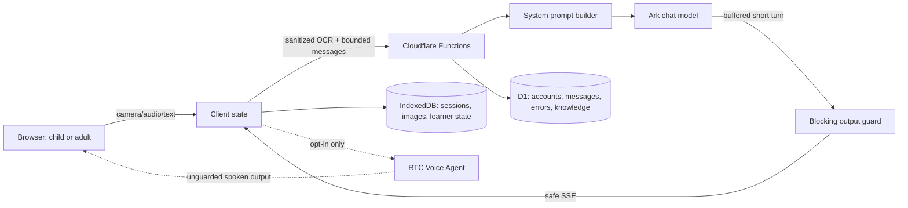

# Architecture and trust boundaries

## Decision in one sentence

ThinkBud keeps child-facing AI behavior behind deterministic input and output boundaries where the transport permits it; the RTC path is disabled by default because its managed ArkV3 agent speaks before the application can inspect the output.

## Enforceable behavior layers

| Layer | Mechanism | Enforcement status |
|---|---|---|
| Product contract | Server-built modular prompt | Enforced for supported server paths; prompt alone is not a safety boundary |
| Untrusted input | NFKC normalization, control/bidi removal, injection flags, role allowlist, length bounds, trust delimiters | Enforced in OCR, chat, RTC context, and knowledge extraction |
| Text output | Full short turn is buffered, audited, and replaced with a safe question on blocking leakage | Enforced before browser display/TTS; adds completion-buffer latency |
| RTC output | Managed Voice Agent sends speech directly | **Not enforceable in current architecture; disabled unless `VITE_ENABLE_RTC=true`** |
| Post-output observation | Compliance issues stored with messages | Diagnostic only; cannot substitute for the blocking guard |
| Release | Unit/integration tests + synthetic eval + provenance + live/human evidence requirements | Deterministic gate runnable; full release intentionally blocked |

The blocking output guard currently treats direct answers, direct answer confirmation, complete worked steps, and indirect numeric hints as safety failures. Pedagogical problems such as weak questions or hollow praise remain release-evaluation failures but are not rewritten at runtime because reliable rewriting requires context and human judgment.

The guard is intentionally conservative and pattern-based. It can block a legitimate equation restatement that resembles a result and can miss novel leakage wording; nearby positive controls reduce but do not eliminate this risk. Fresh live outputs and human review remain mandatory.

## Primary modules

- `functions/_shared/prompt/`: product behavior contract by grade and subject.
- `functions/_shared/input-safety.ts`: shared input trust boundary.
- `functions/_shared/output-guard.ts`: pre-display text safety guard and SSE adapter.
- `functions/_shared/audit.ts`: deterministic response/whiteboard checks.
- `src/lib/failurePolicy.ts`: pure RTC/STT/SSE recovery decisions.
- `evals/`: synthetic data, deterministic runner, grader calibration logic, generated results.
- `provenance/` and `release/`: distribution and release-readiness inputs.

## Data boundaries

The current application can process phone numbers, nicknames, grade, homework images/OCR, audio, full conversation text, emotion/session labels, error stacks, and derived knowledge signals. D1 stores accounts and conversation records; IndexedDB stores local sessions and may include captured image data. External Volcano/Ark/RTC/STT/OCR services process text, images, or audio. Vendor retention, regional transfer, deletion, and data-processing terms are not encoded in this repository and must be verified before a field deployment.

The existing `users` schema stores both raw phone and a phone hash. This conflicts with a strict data-minimisation posture and is a release blocker until the account/recovery purpose is documented or the raw value is removed/migrated.

See [PRIVACY_AND_CHILD_SAFETY.md](PRIVACY_AND_CHILD_SAFETY.md) for the detailed boundary and [evals/README.md](evals/README.md) for evidence layers.
