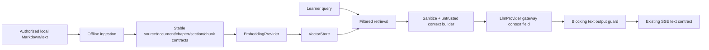

# Textbook RAG and LLM backend

## Decision

ThinkBud now has a testable backend knowledge layer, but not a live textbook product. The implemented path can ingest authorized Markdown/plain text offline, index deterministic synthetic chunks, retrieve filtered evidence, wrap it as untrusted context, call a provider-neutral LLM gateway, and preserve the blocking answer guard. No real textbook, public upload route, production embedding provider, populated Vectorize index, or deployment is included.



## Status matrix

| Capability | Status | Honest boundary |
|---|---|---|
| Source/data contract | Implemented | Stable IDs and SHA-256 content hashes at every hierarchy level; source readiness requires license + provenance + owner/production attestation |
| Markdown/plain ingestion | Implemented offline | Service/CLI only; no anonymous or public upload API |
| Chunking | Implemented | Deterministic character budget/overlap; sections and chapters never merge; page/line/character locators retained |
| Fake embedding + memory store | Synthetic-only | Deterministic, credential-free, process-local; not semantic/quality or durability evidence |
| Retrieval/citations | Implemented and synthetic-tested | top-k, filters, threshold, content-hash dedupe, budgets, stable rank and structured citation metadata |
| RAG context | Implemented | Excerpts pass the existing sanitizer and untrusted wrapper; context is not a system/developer instruction or learner state |
| LLM gateway | Implemented | Provider-neutral completion/stream/usage/error/timeout metadata; Ark adapter retains server-side keys and existing generation defaults |
| Chat integration | Implemented, default-off | Requires an explicit flag and complete service; any RAG failure falls back to original chat; output guard stays last |
| Vectorize | Adapter-only | Binding/schema class exists; binding, index, embedding provider, durable chunk repository and deployment are unconfigured |
| Client citation display | Future | Structured citations are retained in server/eval metadata; current SSE remains backward-compatible text only |

## Data contract and readiness

Every source, document, chapter, section, and chunk carries an ID, title, grade range/label, subject, version, license, provenance, locator, SHA-256 content hash, and `productionReady`. IDs derive deterministically from stable parent keys, order/title, version, and content hash where appropriate.

`productionReady` is true only when all of these are present and affirmative:

- a non-unknown license marked `production-authorized`;
- a known origin and owner;
- owner attestation and production authorization;
- an attestation timestamp.

Missing fields normalize to explicit unknown/false values. They never inherit readiness from the caller or feature flag.

## Offline ingestion

```bash
npm run rag:ingest -- \
  --input /path/to/authorized-book.md \
  --metadata /path/to/source-metadata.json \
  --output /path/to/ingestion-manifest.json \
  --max-chars 1200 \
  --overlap-chars 160
```

The metadata file supplies `source`, `document`, and optional `chunking` fields following `functions/_shared/rag/types.ts`. The operator is responsible for authorization and provenance. The command does not upload, call a provider, or create a production index.

For a credential-free example, use `evals/rag/fixtures/synthetic-upper-math.md` with `evals/rag/fixtures/synthetic-upper-math.metadata.json`; its output must report `Production ready: false`.

Markdown `#` headings create chapters and deeper headings create sections. `<!-- page: 12 -->` or `[PAGE 12]` markers preserve page locators; form feeds advance a plain-text page. Chunking prefers paragraph/line/space boundaries but never crosses a section or chapter.

## Retrieval and citation behavior

`RagRetrievalService` sanitizes embedding inputs, applies subject/grade/source filters in the store and again at the adapter boundary, sorts by score then stable chunk ID, removes duplicate content hashes, and applies character/token budgets. Each match reports `TBn`, all hierarchy IDs/titles, content hash, and page/line/section locator.

`buildRagContext` sanitizes the selected excerpt again at the LLM boundary, wraps each citation with `wrapUntrustedContext`, and reports omitted/truncated citations. The Ark adapter serializes this separate field as a user-role data block; only the server-owned coaching policy is a system message.

## Failure behavior

| Failure | Backend behavior | User-visible contract |
|---|---|---|
| Feature flag absent/false | Skip retrieval | Original non-RAG chat |
| Service/binding/provider incomplete | Mark degraded, do not retrieve | Original non-RAG chat |
| No match after filters/threshold | Attach no context | Original non-RAG chat |
| Embedding/store failure | Catch at chat RAG boundary | Original non-RAG chat |
| Context over budget | Truncate/omit with metadata | Chat continues with bounded or no RAG context |
| Textbook prompt injection | Sanitize, flag and wrap as untrusted | Never promoted to a privileged instruction |
| Model reveals an answer despite RAG | Blocking output guard substitutes safe question | Unsafe text never enters the existing SSE response |

The response headers expose only coarse diagnostics (`X-ThinkBud-RAG`, citation count, truncation flag). Citation bodies are not placed in headers or the legacy SSE stream.

## Synthetic evidence and limits

Run `npm run eval:rag`. The corpus and labels are authored for this repository and contain no copied textbook or participant data. The gate measures deterministic recall@k, precision@k, citation correctness, injection filtering, grade/subject filtering, duplicate handling, no-result behavior, context budgets, provider/store failures, and RAG→fake LLM→output-guard integration.

The result does not measure real textbook coverage, embedding quality, model teaching quality, user adoption, learning outcomes, Vectorize operations, latency, cost, or provider reliability. Those require owner-authorized sources, a production embedding decision, configured infrastructure, fresh live-model evidence, privacy approval, and blinded human review.
