# Synthetic showcase assets

These are historical 2026-08-28 browser captures of ThinkBud's real `synthetic-demo` build. They are not AI-generated product mockups, live-provider results, user testimonials, or production screenshots.

## Data and rights boundary

- Inputs are project-authored synthetic dialogue and synthetic textbook fixtures.
- The current page reads generated `public/eval-report.json` and `public/rag-eval-report.json`.
- The build performs no production-model, paid-API, real-textbook, real-child, or external network call.
- Captures contain only the rendered first-party source-visible UI, bundled open-source UI icons, and generated repository evidence.
- The exact source commit, report hashes, viewport, route, and capture method are recorded in `capture-manifest.json`.
- These reproducible captures introduce no external stock image, font, illustration, textbook, or participant-data source. They remain governed by the repository's no-license-grant boundary.

## Reproduce

For the current page, follow [the README's static build-and-preview steps](../../README.md#quick-start). They run without a live backend. The older `npm run demo` development shortcut is not the complete reproduction path because report JSON is not served correctly in that mode.

Historical screenshots above belong to their frozen commit, routes and viewport in `capture-manifest.json`; today's source is not expected to recreate those pixels. For current captures, use `/thinkbud-ai/#/showcase` and select a preset RAG state from the page, or use a hash-route query such as `/thinkbud-ai/#/?rag=degraded`.

The capture manifest points to frozen `captured-*-report.json` inputs. They are historical screenshot provenance, not the current eval owner. Current results remain in `evals/` and `public/`; use the runnable demo to inspect the latest build.

## Initial interactive demo acceptance · 2026-09-21

The current entry uses **开始数学体验** at `/thinkbud-ai/#/practice`. The historical images above remain frozen. The following screenshots were captured from the independent local review; they depict a running static build, with adult synthetic interactions and no live service. The exact source identity and file hashes are in [this capture manifest](2026-09-21/capture-manifest.json).

1. **Entry — accepted.** Chinese product explanation, current maths scope and a direct practice CTA. Technical evidence is expandable.

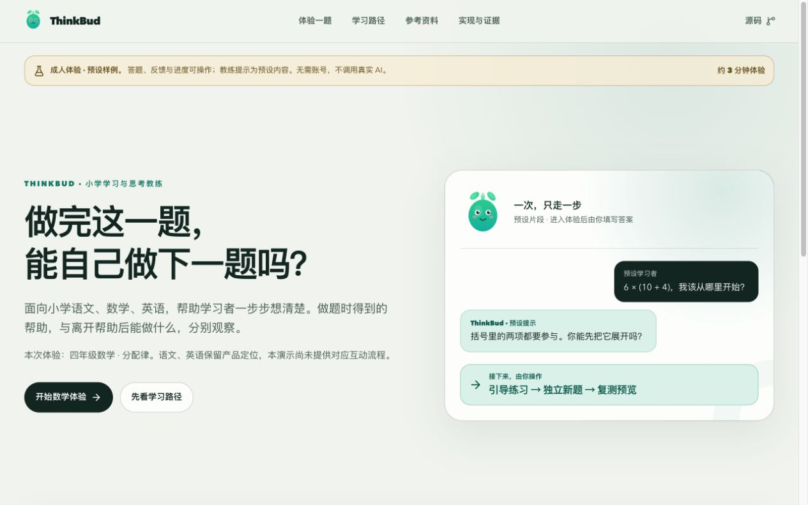

2. **Guided difficulty — accepted.** Two incorrect numeric answers produce a different worked example; mistakes and assistance remain in the observation panel.

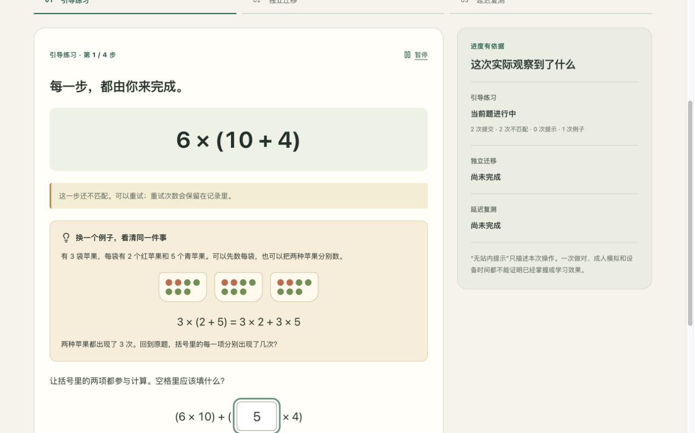

3. **Independent transfer — accepted at 320px.** Four labelled inputs and submission remain usable without horizontal page overflow; hints are replaced by an explicit return-to-practice action.

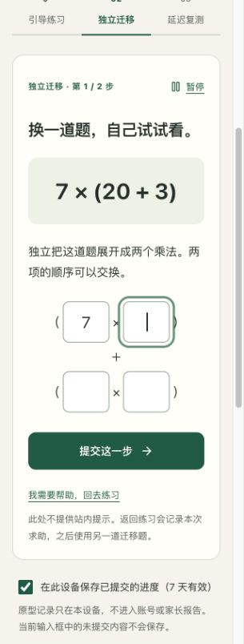

4. **Review preview — accepted.** Preview completion leaves formal review waiting. This capture also distinguishes retry completion from guided completion.

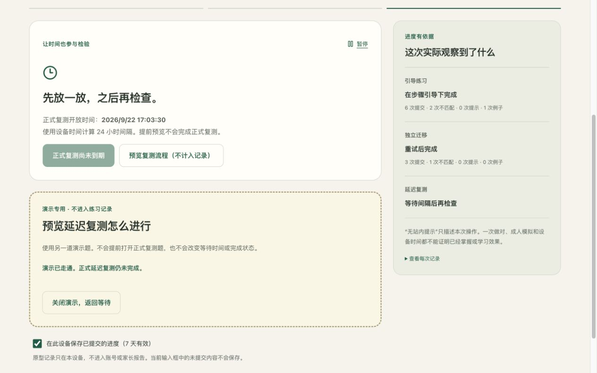

5. **RAG simulation — accepted within its stated boundary.** The chosen failure state is labelled preset and removes the citation.

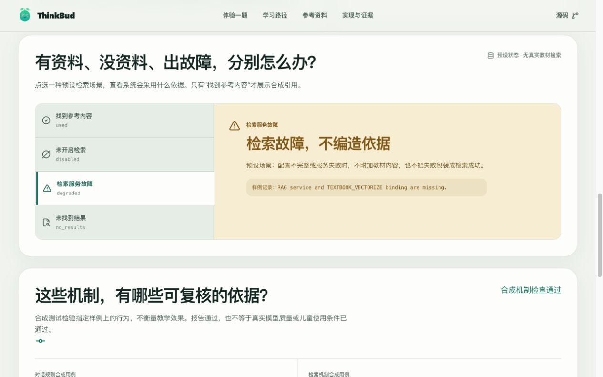

6. **Report failure — repaired and accepted.** A malformed report previously caused a blank screen. The repaired entry remains usable, exposes a retry, and makes no pass judgment without a report.

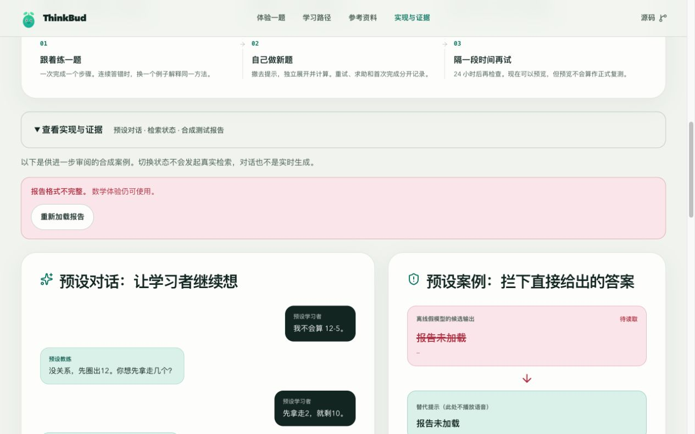

These images support visual/interaction findings, not full accessibility compliance. Keyboard/Tab behavior, local recovery/export and HTTP responses were checked separately as documented in [the README](../../README.md#static-demo-acceptance-and-publication-status--2026-09-21). No physical phone, screen reader, real delayed learning outcome or teaching-quality study was used. [Downloaded synthetic observation JSON](2026-09-21/observations-first-attempt.json) records the first browser run; it excludes raw answers and preview results. All retained earlier `before` screenshots belong to this same review and show the initial candidate.

## Bilingual UI refinement · 2026-09-21

The latest interface follows browser/system language preferences and offers a local **System / 中文 / English** override. The screenshots below show actual browser captures in dark mode, not mockups. The earlier acceptance captures above remain as historical evidence of the first reviewed candidate.

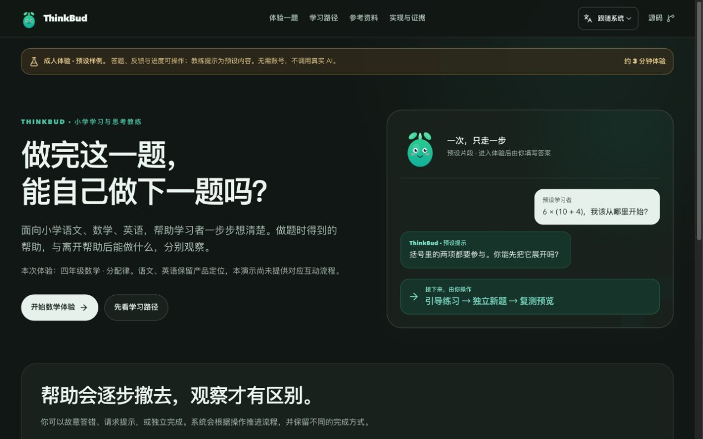

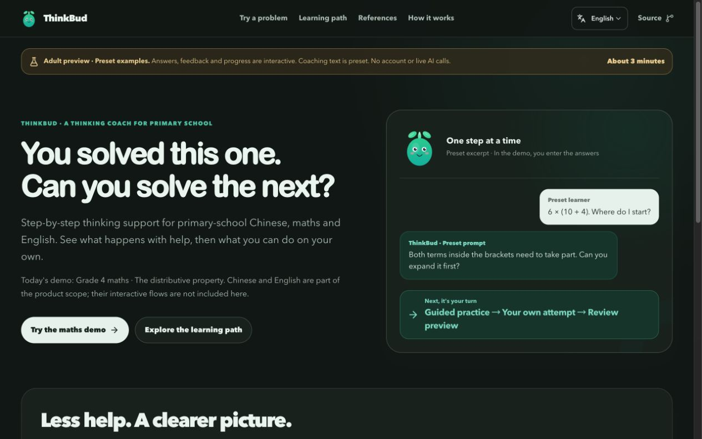

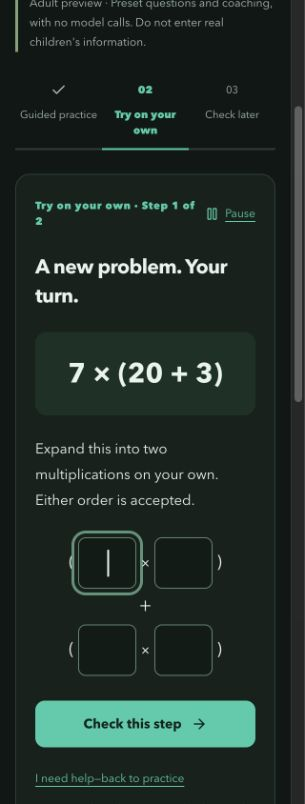

The English walkthrough covered guided help, an unsubmitted answer surviving a language switch, independent completion and the later-check preview. The normal return to the overview now starts at the top. The final 320px homepage was also inspected after its overlapping header controls were repaired; incomplete captures from the screenshot backend were rejected and are not retained. The language resolver, preference persistence and blocked/full storage behaviour are covered by focused tests. Original reports/export keys remain unchanged. These captures do not add a supported English-subject teaching flow or establish an online deployment.

## Visual refinement captures · 2026-09-22

These local acceptance screenshots document the visual refinement now [published on GitHub Pages](https://jeffreyliu0131.github.io/thinkbud-ai/) from `a3fe573e14893eaba6570b6770473a64ba7bfd67`. They were captured before publication; their original provenance is retained. The [capture manifest](2026-09-22/capture-manifest.json) records the source identity and palette-check method.

The direction is a quiet learning surface: a lesson sheet in the overview, continuous numbered learning content, a shared type hierarchy and a main problem area with observations alongside it. The preset boundary, bilingual UI and usable learning flow remain visible.

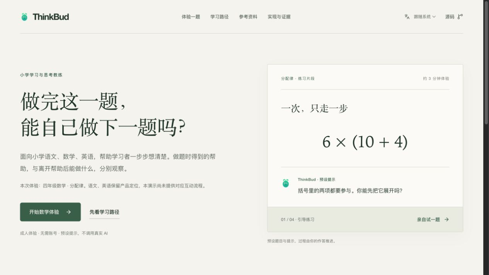

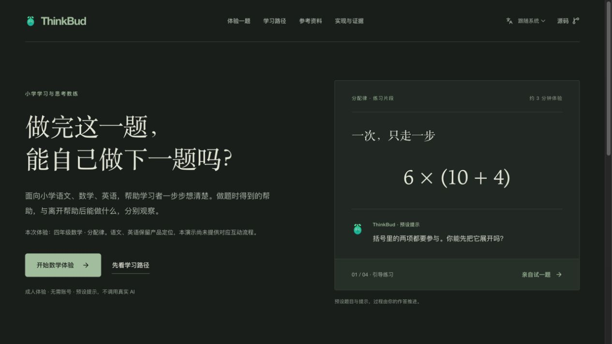

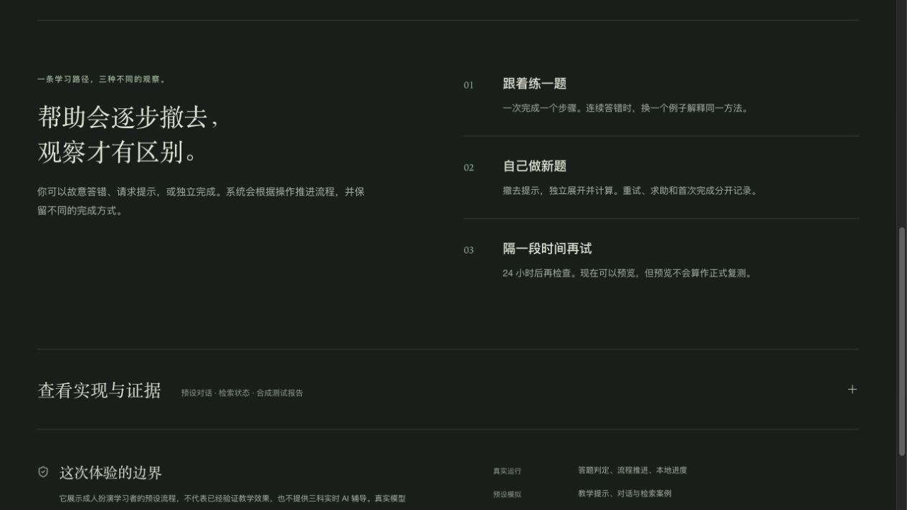

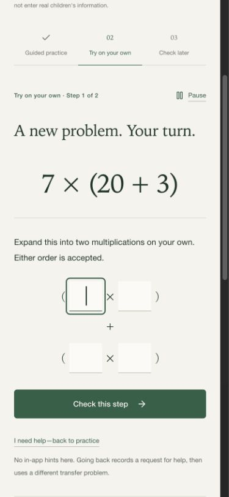

Light images use the same built UI with the dark media condition disabled by a local QA server. They are not a separate design or a published alternate site. The actual normal preview continues to follow the device's colour preference. All inputs shown are adult synthetic role-play; no learning-outcome evidence is implied.
