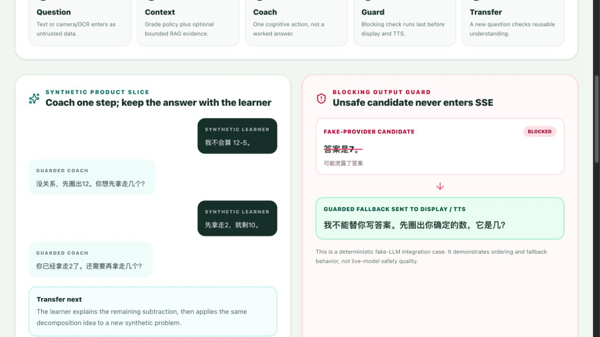
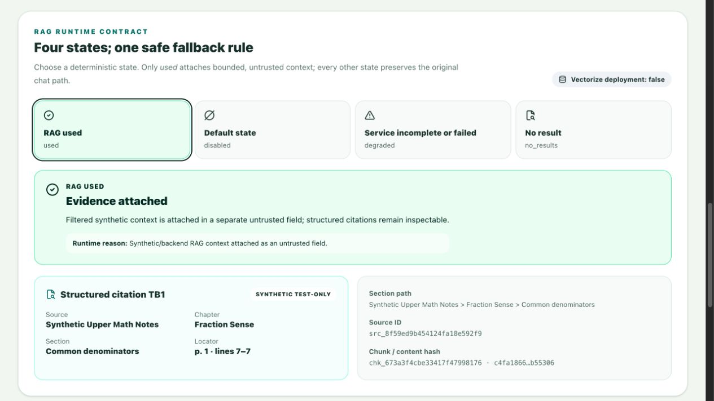
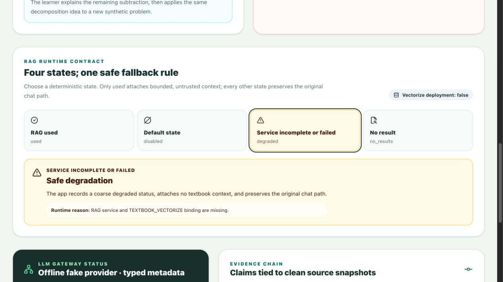
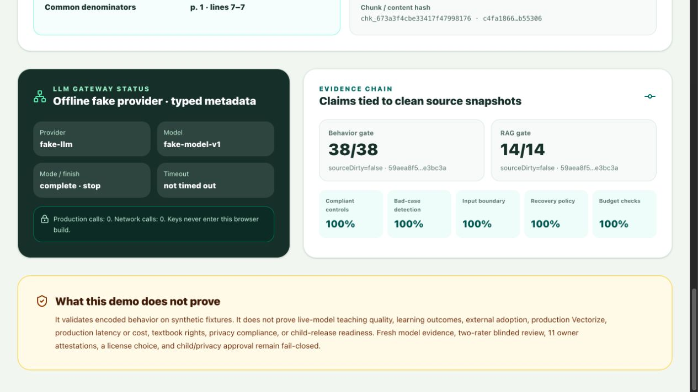

# Synthetic showcase assets

These are historical 2026-08-28 browser captures of ThinkBud's real `synthetic-demo` build. They are not AI-generated product mockups, live-provider results, user testimonials, or production screenshots.










## Data and rights boundary

- Inputs are project-authored synthetic dialogue and synthetic textbook fixtures.
- The current page reads generated `public/eval-report.json` and `public/rag-eval-report.json`.
- The build performs no production-model, paid-API, real-textbook, real-child, or external network call.
- Captures contain only the rendered first-party source-visible UI, bundled open-source UI icons, and generated repository evidence.
- The exact source commit, report hashes, viewport, route, and capture method are recorded in `capture-manifest.json`.
- These reproducible captures introduce no external stock image, font, illustration, textbook, or participant-data source. They remain governed by the repository's no-license-grant boundary.

## Reproduce

```bash
npm ci
npm run demo
```

Capture the local page at the routes and viewport recorded in `capture-manifest.json`. Select the RAG state from the on-page controls or use the documented `?rag=` query parameter.

The capture manifest points to frozen `captured-*-report.json` inputs. They are historical screenshot provenance, not the current eval owner. Current results remain in `evals/` and `public/`; use the runnable demo to inspect the latest build.
